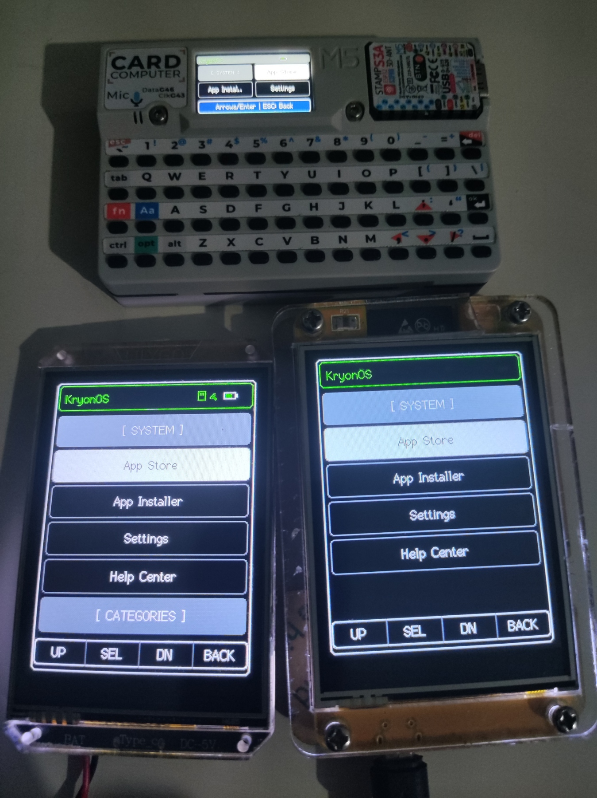
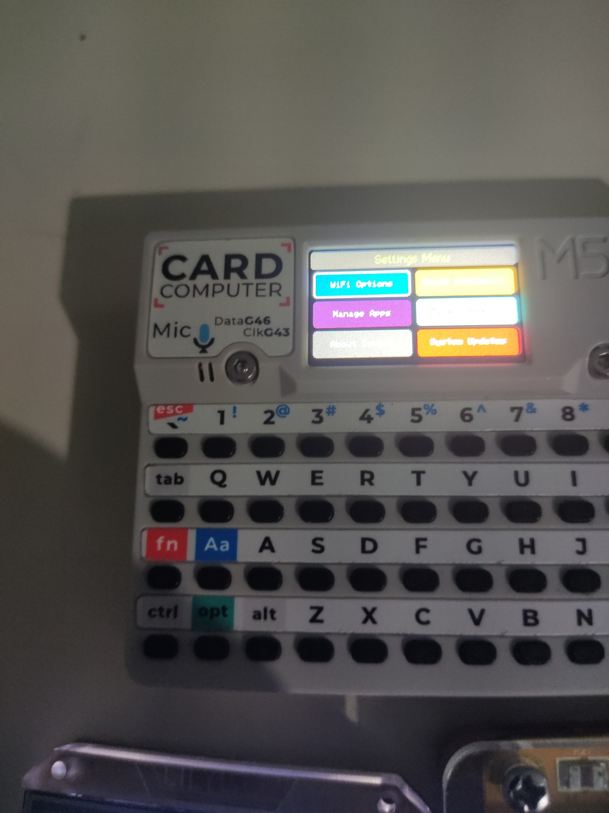
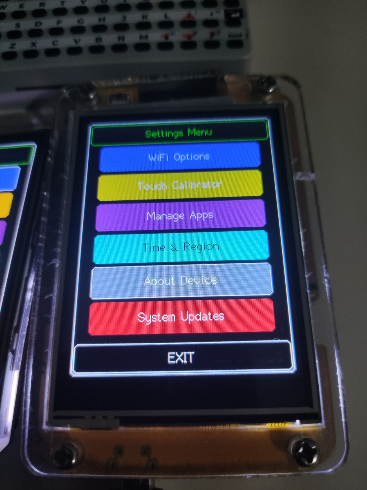
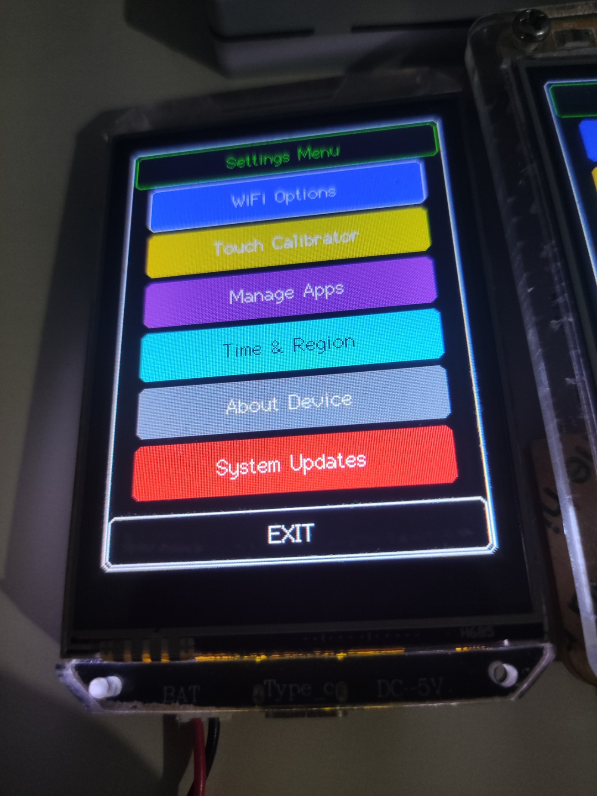

<h1>KryonOS</h1>

  <strong>A GUI JavaScript OS for ESP32</strong>

  An open-source GUI operating system and JavaScript app platform for ESP32 and ESP32-S3, with graphics, hardware APIs, file management, an App Store, and cloud services.

  
  
  

  <a href="https://github.com/Haris16-code/KryonOS/wiki">Documentation</a>
  •
  <a href="https://github.com/Haris16-code/KryonOS/releases">Releases</a>
  •
  <a href="https://github.com/Haris16-code/KryonOS/discussions">Discussions</a>
  •
  <a href="https://github.com/Haris16-code/KryonOS/issues">Issues</a>

 

  <strong>Support KryonOS Hardware Development</strong>

  Help support KryonOS development by contributing toward the hardware, boards, and resources needed for development, testing, and official board support.

  
  
  

  

  

  Funds will help support KryonOS development and testing, including acquiring
  development boards and hardware needed for new features, compatibility, and official board support.

KryonOS is an <strong>open-source</strong>, lightweight, high-performance <strong>GUI Operating System and JavaScript App Runtime</strong> designed specifically for the ESP32 and ESP32-S3 microcontrollers. It provides a complete desktop-like experience on embedded devices, featuring an integrated JS engine (Duktape) for executing standalone JavaScript applications, double-buffered graphics for smooth 2D/3D rendering, KryonCloud services, on-device AI streaming, an App Store, file management, and direct hardware API access.

<table border="1" cellpadding="6" cellspacing="0">
  <thead>
    <tr>
      <th align="center">Multiple Devices Running KryonOS</th>
      <th align="center">M5Stack Cardputer v1.1</th>
      <th align="center">CYD (Cheap Yellow Display)</th>
      <th align="center">LilyGO T-HMI</th>
    </tr>
  </thead>
  <tbody>
    <tr>
      <td align="center"></td>
      <td align="center"></td>
      <td align="center"></td>
      <td align="center"></td>
    </tr>
  </tbody>
</table>

  

<h2>Features</h2>
<ul>
  <li><strong>JavaScript App Runtime (v2.0.0 / API Level 2):</strong> Execute interactive, standalone JS apps natively on the ESP32 using the optimized Duktape ECMAScript engine.</li>
  <li><strong>Multi-Board Hardware Abstraction Layer (HAL):</strong> Unified hardware architecture with out-of-the-box support for touch screens, parallel displays, matrix keyboards, and multi-bus SD cards.</li>
  <li><strong>KryonCloud Services &amp; On-Device AI Engine (<code>Kryon.ai</code> / <code>System.ai</code>):</strong> Real-time token streaming (<code>SSE</code>), structured JSON extraction, and vision processing directly on device.</li>
  <li><strong>KryonBeam Mesh Messenger:</strong> Hardware-to-hardware communication across paired devices with broadcast and direct messaging channels.</li>
  <li><strong>Kryon3D Graphics Rasterizer (<code>Kryon3D</code> / <code>System.graphics3d</code>):</strong> Native hardware-accelerated 3D engine supporting wireframes, solid shaded polygon meshes, camera controls, lighting vectors, and distance fog.</li>
  <li><strong>FastMath Acceleration Engine (<code>FastMath</code> / <code>System.math</code>):</strong> FPU-accelerated trigonometry, pre-computed 360&deg; LUT, and hardware True Random Number Generator (<code>TRNG</code>).</li>
  <li><strong>Anti-Rollback Wireless OTA Updater:</strong> Two-tier manifest resolution (<code>update.json</code>), streaming 4KB chunk flashing, MD5 integrity checks, and automatic bootloader rollback recovery.</li>
  <li><strong>Rich UI &amp; Double-Buffering:</strong> Built-in graphics library with double-buffering and mini-sprite support for tear-free, flicker-free rendering.</li>
  <li><strong>App Store &amp; Cloud Marketplace:</strong> Browse, download, and install JavaScript apps and games dynamically over Wi-Fi.</li>
  <li><strong>File Management &amp; Multi-Bus SD:</strong> Full-featured file explorer and text editor utilizing LittleFS internal storage and high-speed SD/SD_MMC cards.</li>
  <li><strong>Hardware-Backed Security Architecture (v2.0.1):</strong> Silicon TRNG AES-256 encrypted credential vaults (`/system/`), strict TLS root CA certificate verification across all cloud/OTA endpoints, scoped JavaScript runtime sandboxing, and authenticated Web Management.</li>
  <li><strong>Comprehensive Hardware APIs:</strong> Direct JavaScript control over GPIO, I2C bus scanning/transfers, high-frequency PWM tone generators, hardware cryptographic hashing/AES, and ADC battery monitoring.</li>
</ul>

<h2>Supported Hardware</h2>

<table border="1" cellpadding="6" cellspacing="0">
  <thead>
    <tr>
      <th>Hardware Target</th>
      <th>Status</th>
      <th>Microcontroller</th>
      <th>Flash &amp; PSRAM</th>
      <th>Display Driver</th>
      <th>Input Mechanism</th>
    </tr>
  </thead>
  <tbody>
    <tr>
      <td><strong>ESP32-S3 DevKitC-1</strong></td>
      <td><strong>Default / Stable</strong></td>
      <td>ESP32-S3</td>
      <td>16MB Flash, 8MB Octal PSRAM</td>
      <td>ILI9341 240x320 SPI</td>
      <td>XPT2046 Touch</td>
    </tr>
    <tr>
      <td><strong>ESP32 DevKit v1 / WROOM-32</strong></td>
      <td><strong>Stable</strong></td>
      <td>ESP32</td>
      <td>4MB Flash</td>
      <td>ILI9341 240x320 SPI</td>
      <td>XPT2046 Touch</td>
    </tr>
    <tr>
      <td><strong>M5Stack Cardputer v1.1</strong></td>
      <td><em>Experimental</em></td>
      <td>ESP32-S3 (Stamp-S3)</td>
      <td>8MB Flash (Dual OTA)</td>
      <td>ST7789V2 240x135 SPI</td>
      <td>56-Key Physical Matrix Keyboard</td>
    </tr>
    <tr>
      <td><strong>LilyGO T-HMI</strong></td>
      <td><em>Experimental</em></td>
      <td>ESP32-S3</td>
      <td>16MB Flash, 8MB Octal PSRAM</td>
      <td>ST7789 240x320 8-Bit Parallel</td>
      <td>XPT2046 Touch &amp; SD_MMC</td>
    </tr>
    <tr>
      <td><strong>ESP32-CYD-28</strong> <em>(Cheap Yellow Display)</em></td>
      <td><em>Experimental</em></td>
      <td>ESP32</td>
      <td>4MB Flash</td>
      <td>ILI9341 240x320 SPI</td>
      <td>XPT2046 Touch &amp; RGB LED</td>
    </tr>
  </tbody>
</table>

<strong>Note on Experimental Boards (M5Stack Cardputer, LilyGO T-HMI, ESP32-CYD-28):</strong> Target boards marked as <em>Experimental</em> are implemented at the driver and HAL level but currently lack hands-on physical verification due to unavailable test hardware. If you test or flash KryonOS on these boards and encounter any issues or calibration offsets, please submit an issue on GitHub. Community feedback and contributions for these devices are strongly encouraged!

<blockquote>
  
<strong>ESP32-S3 N16R8 Setup:</strong> For wiring schematics, PSRAM configuration, and PlatformIO setup for the default reference board, see the <strong><a href="Documentation/ESP32_S3_N16R8_Guide.md">ESP32-S3 N16R8 Guide</a></strong>.

  
<strong>Multi-Board Architecture:</strong> For pinout tables and build configurations across all supported boards, see the <strong><a href="Documentation/Hardware_Architecture.md">Hardware Architecture Guide</a></strong>.

</blockquote>

<h2>Pin Connections (Default Reference Setup)</h2>

KryonOS requires an ILI9341 2.8 Inch Touch display and an SD card module. To achieve the best performance and avoid bus collisions, KryonOS uses <strong>split SPI buses</strong>.

<ul>
  <li><strong>VSPI / Main SPI:</strong> Used exclusively for the TFT Display and Touch controller.</li>
  <li><strong>HSPI / Secondary SPI:</strong> Used exclusively for the SD Card Module.</li>
</ul>

<blockquote>
  
<strong>ESP32 Marauder Compatibility:</strong> Out-of-the-box, the default display and touch pinouts in KryonOS match the <strong>ESP32 Marauder (v4, v6, and v6.1)</strong> hardware!

</blockquote>

<h3>Default Pin Configuration (ESP32 WROOM-32 / DevKit v1)</h3>

<table border="1" cellpadding="6" cellspacing="0">
  <thead>
    <tr>
      <th>ILI9341 2.8 Inch Touch Display Pins</th>
      <th>ILI9341 Display Pin Labels</th>
      <th>ESP32 Pin</th>
    </tr>
  </thead>
  <tbody>
    <tr>
      <td><strong>1</strong></td>
      <td>VCC</td>
      <td>3.3V</td>
    </tr>
    <tr>
      <td><strong>2</strong></td>
      <td>GND</td>
      <td>GND</td>
    </tr>
    <tr>
      <td><strong>3</strong></td>
      <td>CS</td>
      <td>D17 (TXD 2)</td>
    </tr>
    <tr>
      <td><strong>4</strong></td>
      <td>RESET</td>
      <td>D5</td>
    </tr>
    <tr>
      <td><strong>5</strong></td>
      <td>DC</td>
      <td>D16 (RXD 2)</td>
    </tr>
    <tr>
      <td><strong>6</strong></td>
      <td>SDI (MOSI)</td>
      <td>D23</td>
    </tr>
    <tr>
      <td><strong>7</strong></td>
      <td>SCK</td>
      <td>D18</td>
    </tr>
    <tr>
      <td><strong>8</strong></td>
      <td>LED</td>
      <td>D32</td>
    </tr>
    <tr>
      <td><strong>9</strong></td>
      <td>SDO (MISO)</td>
      <td>D19</td>
    </tr>
    <tr>
      <td><strong>10</strong></td>
      <td>T_CLK</td>
      <td>D18</td>
    </tr>
    <tr>
      <td><strong>11</strong></td>
      <td>T_CS</td>
      <td>D21</td>
    </tr>
    <tr>
      <td><strong>12</strong></td>
      <td>T_DIN</td>
      <td>D23</td>
    </tr>
    <tr>
      <td><strong>13</strong></td>
      <td>T_DO</td>
      <td>D19</td>
    </tr>
    <tr>
      <td><strong>14</strong></td>
      <td>T_IRQ</td>
      <td>X (Not Connected)</td>
    </tr>
  </tbody>
</table>

<h3>SD Card Module (HSPI)</h3>
<table border="1" cellpadding="6" cellspacing="0">
  <thead>
    <tr>
      <th>SD Card Module</th>
      <th>ESP32 Pin</th>
      <th>Notes</th>
    </tr>
  </thead>
  <tbody>
    <tr>
      <td><strong>MOSI</strong></td>
      <td>GPIO 13</td>
      <td>SD SPI MOSI</td>
    </tr>
    <tr>
      <td><strong>MISO</strong></td>
      <td>GPIO 26</td>
      <td>SD SPI MISO</td>
    </tr>
    <tr>
      <td><strong>SCK / CLK</strong></td>
      <td>GPIO 14</td>
      <td>SD SPI Clock</td>
    </tr>
    <tr>
      <td><strong>CS</strong></td>
      <td>GPIO 15</td>
      <td>SD Card Chip Select</td>
    </tr>
  </tbody>
</table>

<h2>How to Flash</h2>

<h3>Option 1: Using Precompiled Binaries</h3>

You can download the latest precompiled firmware <code>.bin</code> files directly from our <a href="https://github.com/Haris16-code/KryonOS/releases">Releases Page</a>.

Use an ESP32 flasher tool (such as <code>esptool.py</code> or the official ESP Flash Download Tool) to write the binaries:

<pre>esptool.py --chip esp32s3 --port COM14 --baud 921600 write_flash -z \
  0x0 bootloader.bin \
  0x8000 partitions.bin \
  0xe000 boot_app0.bin \
  0x10000 firmware.bin</pre>

<h3>Option 2: Build &amp; Flash via PlatformIO</h3>

To compile and flash from source:

<pre># 1. Clone repository
git clone https://github.com/Haris16-code/KryonOS.git
cd KryonOS

# 2. Build &amp; Upload for Default Board (ESP32-S3 DevKitC-1 N16R8)
pio run -e esp32-s3-devkitc-1-n16r8 -t upload

# Or compile for other boards:
pio run -e m5stack-cardputer -t upload   # M5Stack Cardputer
pio run -e lilygo-t-hmi -t upload        # LilyGO T-HMI
pio run -e esp32-cyd-28 -t upload        # ESP32 Cheap Yellow Display
pio run -e esp32doit-devkit-v1 -t upload # ESP32 DevKit v1</pre>

<h2>Documentation</h2>

<table>
  <tr>
    <td><a href="Documentation/Hardware_Architecture.md"><strong>Hardware Architecture</strong></a></td>
    <td>Hardware configuration and system architecture.</td>
  </tr>
    <tr>
    <td><a href="https://github.com/Haris16-code/KryonOS/wiki/How-To-Setup-KryonCloud"><strong>Setup Your KryonCloud</strong></a></td>
    <td>Connect your device to access KryonCloud services</td>
  </tr>
    <tr>
    <td><a href="Documentation/App_Development_Guide.md"><strong>App Development Guide</strong></a></td>
    <td>Build applications for KryonOS.</td>
  </tr>
  <tr>
    <td><a href="https://kryonos.harislab.tech/docs/javascript-api"><strong>JavaScript API Docs</strong></a></td>
    <td>APIs available to JavaScript applications.</td>
  </tr>
  <tr>
    <td><a href="https://kryonos.harislab.tech/docs/javascript-api/kryon3d"><strong>Kryon3D Engine Docs</strong></a></td>
    <td>Developing with the Kryon3D graphics engine.</td>
  </tr>
  <tr>
    <td><a href="CHANGELOG.md"><strong>Changelog</strong></a></td>
    <td>Changes, additions, fixes, and breaking changes.</td>
  </tr>
  <tr>
    <td><a href="https://github.com/Haris16-code/KryonOS/discussions"><strong>Discussions</strong></a></td>
    <td>Community discussions and development topics.</td>
  </tr>
</table>

  <a href="https://github.com/Haris16-code/KryonOS/wiki">
    <strong>Visit the KryonOS Documentation →</strong>
  </a>

<h2>Community</h2>

Have a question, found a bug, want to contribute, or want to discuss a new feature?
Join the KryonOS community.

  <a href="https://github.com/Haris16-code/KryonOS/discussions">GitHub Discussions</a>
  •
  <a href="https://github.com/Haris16-code/KryonOS/issues">Issues</a>
  •
  <a href="https://github.com/Haris16-code/KryonOS/pulls">Pull Requests</a>

<h2>Contributing</h2>

Contributions are welcome.
Before opening a pull request, please review the project documentation and existing architecture.

Areas where contributions are especially useful include:

<ul>
  <li>New board support</li>
  <li>Display and touch drivers</li>
  <li>Hardware integrations</li>
  <li>JavaScript APIs</li>
  <li>JavaScript applications for KryonOS</li>
  <li>Graphics and 3D engine improvements</li>
  <li>Bug fixes</li>
  <li>Documentation</li>
  <li>Hardware testing and validation</li>
</ul>
<h2>Support KryonOS</h2>

KryonOS is an independent, open-source project. Developing an operating system, maintaining multi-board hardware drivers, and building runtime engines requires significant time and physical test equipment.

Due to budget constraints, experimental board ports (Cardputer, T-HMI, CYD) cannot yet be bench-tested in person. Your financial support directly funds the acquisition of hardware test boards, displays, sensors, and continuous software development.

&rarr; <a href="https://harislab.lemonsqueezy.com/checkout/buy/9b37ee2c-e26a-4626-990f-f18834916276?logo=0">Support KryonOS Development</a>

<h2>Stay Updated: Firmware Releases &amp; Development News</h2>

Subscribe to official KryonOS development updates to receive email notifications about new releases, newly supported hardware boards, architecture deep dives, and upcoming features:

&rarr; <a href="https://kryonos.harislab.tech/subscribe">Subscribe to KryonOS Updates</a>

<h2>Star the Project</h2>

If you like KryonOS or find this project useful, please consider giving our repository a <strong>Star on GitHub</strong>! Every star boosts project visibility, helps grow the embedded JavaScript community, and motivates ongoing development.

&rarr; <a href="https://github.com/Haris16-code/KryonOS">Star KryonOS on GitHub</a>

<h2>Contact Us</h2>

  For sponsorships and technical support, contact us at
  <a href="mailto:kryonos@harislab.tech"><strong>kryonos@harislab.tech</strong></a>.

<h2>License</h2>

KryonOS is licensed under the <a href="./LICENSE">GNU General Public License v3.0</a>.

